# Подпись, OCR и две оценки юмора

Это отдельный профиль `humor_ocr`. Существующий `taxonomy` сохраняет прежние
веса и текстовый вход. OCR не дописывает текст в оригинал и не включает отправку MAX.

## Что происходит с одним постом

```mermaid
flowchart LR
    M[Сохранённый пост и альбом] --> O[Очередь OCR]
    O --> P[Картинки / статические превью]
    P --> R[PP-OCRv5 RU + EN]
    R --> I[caption_ocr_v1: подпись + надписи]
    I --> C[TF-IDF либо MiniLM: humor_ocr]
    C --> F[Шутка И Хватает контекста]
    F --> L[Пользовательский лейбл Смешное]
    L --> S[Источник и оригинальные вложения]
    S --> Q[На публикацию]
```

Видео не просматривается целиком. Берётся крупнейшее статическое превью Telegram;
`VideoSize` исключается. Если статического превью нет, FFmpeg извлекает первый
кадр сохранённого видео. Для GIF читается первый кадр. Для подписи длиннее
500 символов OCR пропускается, профиль получает текстовый вход.

В альбоме используется порядок исходных сообщений. Пока известные вложения
не готовы, полный вход не считается готовым. Превью находятся отдельно от
`media`, чтобы обычный загрузчик не перепутал их с оригиналом для публикации.

## Code-map

| Действие | Реализация | Хранение / настройка |
|---|---|---|
| Выбрать статическое превью, скачать отдельно | `app/ocr/media.py`: `static_thumbnail`, `download_preview` | `OCR_PREVIEW_DIR`; `telegram_posts.ocr_preview_path` |
| Извлечь первый кадр с таймаутом | `app/ocr/media.py`: `first_frame` | временный файл, удаляется после чтения |
| Проверить весь альбом и хеши файлов | `app/ocr/jobs.py`: `snapshot` | `ocr_jobs.source_sha256`, `ocr_runs.inputs` |
| Поставить OCR, сохранить отдельный запуск | `enqueue_ocr` | `ocr_jobs`, `ocr_runs`; повтор не создаёт второе текущее задание |
| Распознать строки и координаты | `app/ocr/engine.py`: `OcrEngine.read` | `ocr_runs.results`: текст, bbox, score, SHA, версия, время |
| Подготовить вход, не менять оригинал | `compose_input`, `input_digest` | контракт `caption_ocr_v1`, отдельный `input_sha256` |
| Одна задача, кеш, таймаут, повторы | `app/ocr/worker.py`: `Reader`, `process`, `run` | `cache/ocr-results`; 10 / 30 / 120 секунд, затем остановка |
| Изолировать зависшее распознавание | `app/ocr/runner.py` | дочерний процесс; родитель завершает его по таймауту |
| Классификация и история двух моделей | `app/taxonomy/jobs.py`, `worker.py` | `taxonomy_classifications`, `taxonomy_runs`; ключ карточка / модель / профиль |
| Не обрезать слишком длинный вход | `app/taxonomy/input_contract.py`: `InputGuard` | общий закреплённый tokenizer, максимум 512 токенов |
| Загрузить только один профиль MiniLM | `app/taxonomy/worker.py` | `HUMOR_MODEL_DIR` / `TAXONOMY_MODEL_DIR`; предыдущий encoder освобождается |
| Проверить две фактические оценки | `app/content/selection_rules.py`, `selection_filters.py` | версия фильтра содержит `profile`; словарь лейблов отдельный |
| Не принять устаревший OCR | `classification_input_current`, `current_assessment` | проверяются подпись, вложения, OCR-версия и полный вход |
| Подготовить оригинал к публикации | `app/content/post_preparation.py` | `marked_text`, источник, исходные файлы; OCR сюда не попадает |
| Запустить и прочитать OCR вручную | `app/web/main.py`: `pipeline_ocr` | защищённые `GET/POST /api/pipeline/{id}/ocr` |
| Профиль, две стрелки, сравнение | `pipeline.js`, `taxonomy-compare.js`, `ocr.js` | только рассчитанные оценки, история версий и отдельное время |
| Проверить и заморозить ручную разметку | `scripts/humor_corpus.py` | защищённый каталог вне Git; старые holdout исключаются |
| Обучить две головы и контроль без OCR | `scripts/train_humor_models.py` | четыре эпохи, batch 8; выбор на validation до чтения test |

## Данные и версии

`telegram_posts.text` остаётся исходной подписью. `text_sha256` относится к ней,
`input_sha256` — к полному входу с OCR. Замена файла или OCR делает классификацию
устаревшей даже при неизменной подписи. История прежних запусков сохраняется.

`ocr_jobs` хранит текущее задание, число попыток, срок повтора и ошибку.
`ocr_runs` хранит каждый запуск отдельно. Миграция `0017_humor_ocr` переносит
старые классификации и версии фильтров в профиль `taxonomy`.

`scripts/prepare_ocr_models.py` заранее скачивает официальные веса, проверяет
суммы и создаёт `ocr-manifest.json`. OCR runtime работает без сети и без
автоматического скачивания. Версия включает manifest и алгоритм подготовки.

Модельный manifest связывает веса, taxonomy, tokenizer и параметры обучения
контрольными суммами. Строка версии в карточке берётся из загруженного артефакта.

## Ручной запуск и ограничения

1. Выбрать «Юмор + OCR», нажать стрелку TF-IDF или MiniLM.
2. Карточка блокируется. Видно очередь OCR, загрузку модели, классификацию.
3. OCR раскрывается рядом с вложениями. Низкая оценка чтения, отсутствие части
   альбома и превышение входа требуют ручного разбора.
4. При успешной классификации сравниваются «Шутка» и «Хватает контекста».
   Это оценки модели, не доказанная вероятность истины.
5. Повтор создаёт новый запуск с историей. При изменённом входе прежний результат
   нельзя использовать для фильтра, маркировки и готовности.

Пустая подпись с содержательным OCR допускает классификацию. Если после OCR
нет текста — «Только медиа». При отсутствии и текста, и вложений — «Пустой».
Картинка без текстовой шутки не считается положительным учебным примером только
потому, что опубликована в мемном канале.

## Сбор корпуса и проверка качества

Скрипты не ставят смысловых меток. Codex читает подпись и полный OCR и записывает
`is_joke`, `input_has_context`: «да», «нет» или «неясно», с основанием.
Старая разметка не переносится на новые признаки по догадке. Неясные метки
исключаются из соответствующего loss; они не становятся отрицательными.

Для train нужно 1100 уникальных положительных и 1000 отрицательных примеров,
для validation/test — по 150 обоих классов. Квота считается по группам повторов,
полным альбомам, пригодному OCR и входу не длиннее 512 токенов.
Материалы старых validation/test зарезервированы. Близкие варианты шутки
связываются после прочтения, до заморозки выборок.

TF-IDF без OCR обучается на тех же строках и разбиении. Это контроль того,
что надписи действительно дают пользу. Проверяются ошибки, калибровочные
интервалы, precision/recall/F1, короткие подписи и отрицательные примеры
из самого itmemes. Название канала не считается доказательством юмора.

Порог и победитель выбираются только на validation: минимум 50 совпадений и
92% согласия с Codex. На test требуется минимум 50 и 90%. Test не используется
для повторной настройки. Это согласие с агентом, а не независимая человеческая точность.

## Выпуск и откат

`deploy/publisher.compose.yaml` добавляет `ocr-worker` через Compose-профиль `ocr`:
768 MiB / 0,5 CPU, один ONNX-поток и одна задача. В отдельном `ocr.env` находятся
только настройки OCR и БД. Telegram/MAX-секреты, session-файлы и сеть Telegram
этому процессу не передаются. Web и coordinator не загружают ONNX.

Сначала CI и миграция, потом ручной профиль и браузерная проверка. Автоматический
фильтр включается только после квот, качества, 100 измеренных вложений и
проверки нового сообщения. Требования: p95 OCR до 10 секунд, классификация до
2 секунд, доступная RAM от 1,5 GiB, свободный диск от 30 GiB, без OOM.
Ошибочные измерения, таймауты и частичные результаты не считаются успехом.

Старый необработанный буфер не получает задания OCR при создании фильтра.
Семь существующих тематических фильтров остаются на `taxonomy`. Отправитель MAX
сохраняет своё состояние; этот этап не отменяет его прежние проверки допуска.
Откат выключает OCR-профиль и возвращает прежние образы/настройки, сохраняя
схему, корпус, историю OCR, классификаций и доставок.

## Источники

- [RapidOCR 3.9.2: официальные модели](https://github.com/RapidAI/RapidOCR/blob/v3.9.2/python/rapidocr/default_models.yaml)
- [ONNX Runtime](https://pypi.org/project/onnxruntime/)
- [Telethon: download_media и типы thumbnail](https://docs.telethon.dev/en/stable/modules/client.html#telethon.client.downloads.DownloadMethods.download_media)
- [FFmpeg](https://www.ffmpeg.org/ffmpeg.html)
